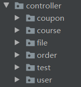
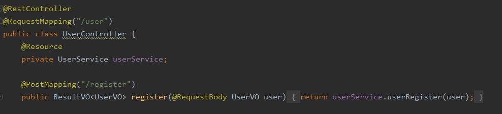
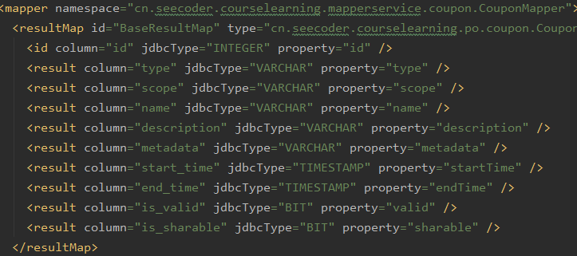
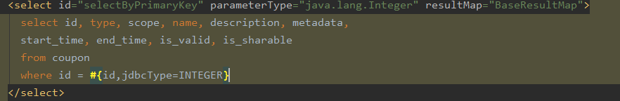
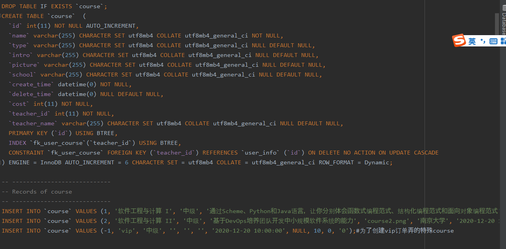

#### Database

**基础表应该与包名相同：**

- 比如说我们有user的package
- 那么对应的数据库表名应该是
  - user
  - 如果有关联的表可以用下划线_连接
  - 比如
    - user_info
    - user_coupon
    - ...

#### 开发流程

案例说从Controller到数据库要能跑通应该是这么一路跑下来的（用去年软工二的截图举例）

**开发：**

0. *新建对应的包

1. 编写前后端通信的中介VO

2. 

3. 以VO为参数在controller写接口

   - 注意路由前缀RequestMapping

   

4. controller下面到service

5. service先新建接口

6. 再在serviceImpl里面实现接口

7. 新建Service层和数据层的通信组件PO

8. 创建mapperService(DAO)的接口

9. 通过在Resource/mapper里面写对应的XML文件实现接口

   - mybatis的配置建议用resultMap解耦
   - 

   - 返回类型填对应Map即可
   - 
   - 当然你要觉得这部分基本不会改也可以直接填参数

**测试和善后：**

> 并不是指严格的测试文件

1. 把数据库的构建写到sql文件中以便复现
   - 包括预设数据
   - 
   - 注意这里的AUTO_INCREMENT参数应该对应下一个ID的值（这里应该写4的，但忘了改了写了6，反正至少不要小于下一个ID，不然会出错）
2. 自己用POSTMAN测试下是不是真的运行起来了

但因为这几个层之间并不严格一一对应，所以实际开发自己酌情考虑

