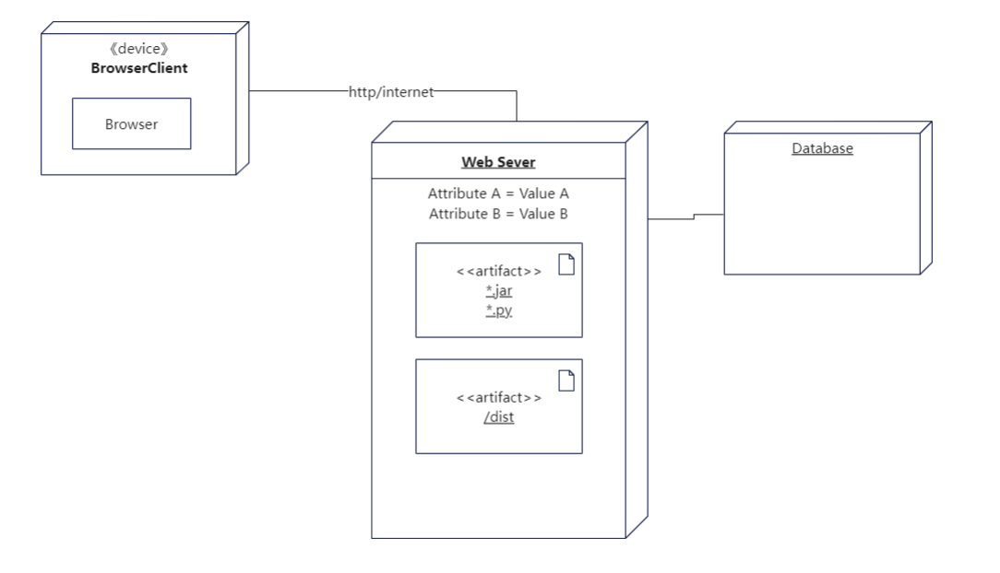

## 3.软件技术阐述

### 3.1 环境配置与技术详解

#### 3.1.1 概述

​	本系统主要使用JavaScript，Java, Python, SQL等语言进行开发，具体采用Vue框架开发Web前端服务SSM（Spring+SpringMVC+MyBatis）框架开发后端，同时用Python语言训练推荐算法，并用MySQL进行数据存储。前后端使用 JSON 作为数据传输格式。开发过程中使用UML进行系统的设计，使用Git管理代码及代码的依赖关系，搭建Git项目用于小组间的信息共享，部署过程中使用Jenkins与Docker进行CI/CD

#### 3.1.2 SSM

SSM（Spring+SpringMVC+MyBatis）框架集由Spring、MyBatis两个开源框架整合而成，

Spring 框架是一个由 Rod Johnson 编写的，并且 2003 年 6 月首次在 Apache 2.0 许可下发布的开源 Java 平台，它为容易而快速的开发出耐用的 Java 应用程序提供了全面的基础设施。

MyBatis 是一款优秀的持久层框架，它支持自定义 SQL、存储过程以及高级映射。MyBatis 免除了几乎所有的 JDBC 代码以及设置参数和获取结果集的工作。MyBatis 可以通过简单的 XML 或注解来配置和映射原始类型、接口和 Java POJO（Plain Old Java Objects，普通老式 Java 对象）为数据库中的记录。

整个SSM框架的工作流程就是使用Spring MVC负责请求的转发和视图管理，Spring实现业务对象管理，Mybatis作为数据对象的持久化引擎。

#### 3.1.3 MySQL

MySQL是一个中、小型关系型数据库管理系统，由瑞典MySQL AB公司开发，目前属于Oracle公司。MySQL是一种关联数据库管理系统，关联数据库将数据保存在不同的表 中，而不是将所有数据放在一个大仓库内，这样就增加了速度并高了灵活性。MySQL的SQL语言是用于访问数据库的最常用标准化语言。

#### 3.1.4 Git

Git 是一个开源的分布式版本控制系统，用于敏捷高效地处理任何或小或大的项目，是Linus Torvalds为了帮助管理 Linux 内核开发而开发的一个开放源码的版本控制软件。与常用的版本控制工具 CVS, Subversion 等不同，它采用了分布式版本库的方式，不必服务器端软件支持，更为灵活。

#### 3.1.5 UML

Unified Modeling Language (UML）又称统一建模语言或标准建模语言，是始于1997年一个OMG标准，它是一个支持模型化和软件系统开发的图形化语言，为软件开发的所有阶 段供模型化和可视化支持，包括由需求分析到构造和配置。UML是面向对象分析与设计方 法在 80 年代末至 90 年代高速发展的产物，它不仅统一了Booch、Rumbaugh和Jacobson 的表示方法，而且对其作了进一步的发展，并最终统一为大众所接受的标准建模语。

#### 3.1.6 Jenkins

Jenkins是一个独立的开源软件项目，是基于Java开发的一种持续集成工具，用于监控持续重复的工作，旨在提供一个开放易用的软件平台，使软件的持续集成变成可能。前身是Hudson是一个可扩展的持续集成引擎。可用于自动化各种任务，如构建，测试和部署软件。Jenkins可以通过本机系统包Docker安装，甚至可以通过安装Java Runtime Environment的任何机器独立运行。

#### 3.1.7 Docker

Docker 是一个开源的应用容器引擎，基于 Go 语言 并遵从 Apache2.0 协议开源。Docker 可以让开发者打包他们的应用以及依赖包到一个轻量级、可移植的容器中，然后发布到任何流行的 Linux 机器上，也可以实现虚拟化.所谓容器是完全使用沙箱机制，相互之间不会有任何接口（类似 iPhone 的 app）,更重要的是容器性能开销极低。

#### 3.1.8 技术总结

	<h4>
    一、使用框架
  </h4>  

| Spring Boot |  服务器端框架   |
| :---------: | :-------------: |
|   **Vue**   | **Web前端框架** |

	<h4>
    二、环境搭建
  </h4>  

|     Linux      |     服务器环境     |
| :------------: | :----------------: |
| **Windows 10** |    **开发环境**    |
|   **MySql**    |  **关系型数据库**  |
|   **JRE 8**    |  **Java运行环境**  |
| **Python3.9**  | **Python运行环境** |

	<h4>
    三、编程语言
  </h4>  

|      Java      |           服务端开发语言           |
| :------------: | :--------------------------------: |
| **JavaScript** |      **Web前端主要开发语言**       |
|   **Python**   | **推荐算法、语音识别主要开发语言** |
|  **JSON**  | **网络通信数据格式** |

	<h4>
    四、开发工具
  </h4>  

|      IntelliJ IDEA      |           Java 开发 IDE           |
| :------------: | :--------------------------------: |
|  **Mavan**  | **Java 项目版本依赖** |
| **Web Storm** | **Web 前端开发 IDE** |
| **NPM** | **JavaScript 包管理工具** |
| **PyCharm** | **Python 开发 IDE** |
|   **Git**   | **项目代码管理工具** |
| **Jenkins** | **CI/CD工具** |

### 3.2 体系结构设计

#### 3.2.1 用例试图

#### 3.2.2 逻辑视图

#### 3.2.3 开发视图

#### 3.2.4 进程视图

#### 3.2.5 部署视图

